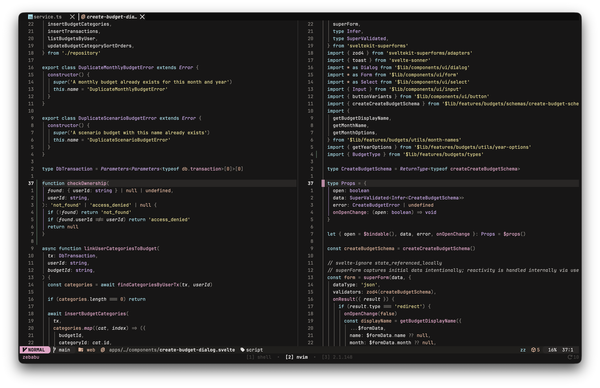

# meowsoot

A dark Neovim colorscheme. Pure Lua, no runtime dependencies.

## The story

A fusion of two ideas. The charcoal background is inspired by **Susuwatari** — the wandering soot sprites from Studio Ghibli films. The pink and peach accents are inspired by **Nyan Cat**'s pop-tart palette. The rest of the colors — cyan, lavender, yellow, blue — were tuned to round out the system.

It's a **cyan / pink / lavender / yellow**-oriented colorscheme. **No green in code** — green exists in the palette but is reachable only through UI semantic aliases (diff add, git add, success state, ANSI terminal slot 2). Strings are yellow, escapes are peach, types are lavender, functions are pink.

Six-hue chromatic palette anchored at 190° · 208° · 275° · 328° · 20° · 50°, warm-biased, AAA contrast throughout.



## Install

Requires Neovim 0.9+. **No external dependencies.**

### lazy.nvim

```lua
{
  "marekh19/meowsoot.nvim",
  lazy = false,
  priority = 1000,
  config = function()
    vim.cmd.colorscheme("meowsoot")
  end,
}
```

### Local development

```lua
{
  dir = "/path/to/meowsoot",
  lazy = false,
  priority = 1000,
  config = function()
    vim.cmd.colorscheme("meowsoot")
  end,
}
```

## Configuration

All options are optional. Defaults shown.

```lua
require("meowsoot").setup({
  transparent = false,            -- transparent backgrounds
  terminal_colors = true,         -- set vim.g.terminal_color_0..15

  styles = {
    comments  = { italic = true },
    keywords  = {},
    functions = {},
    variables = {},
    sidebars  = "dark",           -- "dark" | "transparent" | "normal"
    floats    = "dark",
  },

  -- Plugin highlight groups. Auto-detected via lazy.nvim if `auto = true`.
  plugins = {
    all  = false,
    auto = true,
    -- Force-enable / disable individual plugins:
    -- telescope = true,
    -- gitsigns = false,
  },

  cache = true,                   -- cache compiled highlights to disk

  on_colors = function(c) end,    -- mutate the color table
  on_highlights = function(hl, c) end, -- mutate the highlight table

})
vim.cmd.colorscheme("meowsoot")
```

### Plugins covered out of the box

`gitsigns` · `telescope` · `nvim-cmp` · `blink.cmp` · `lazy.nvim` · `flash.nvim` · `nvim-tree` · `indent-blankline` · `treesitter-context` · `snacks.nvim` · `mini.icons` / `mini.files` / `mini.statusline` / `mini.indentscope` / `mini.diff` / `mini.notify` / `mini.pick` · `noice` · `which-key` · `trouble` · `render-markdown` · `fzf-lua`

### lualine

Use the bundled lualine theme:

```lua
require("lualine").setup({ options = { theme = "meowsoot" } })
```

## Extras (terminal / multiplexer / shell)

Pre-generated configs live in `extras/`:

| Tool    | File                              |
|---------|-----------------------------------|
| Ghostty | `extras/ghostty/meowsoot`      |
| Tmux    | `extras/tmux/meowsoot.tmux`    |
| Fish    | `extras/fish/meowsoot.fish`    |

These are output artifacts — don't edit by hand, they get overwritten on regeneration.

### Regenerating

After tuning `lua/meowsoot/palette.lua`:

```sh
just extras
```

The extras are built by a small Lua generator (`lua/meowsoot/extras/`) using only headless Neovim — no external build deps.

| Recipe          | What it does |
|-----------------|--------------|
| `just check`    | Headless smoke-test: load the colorscheme, fail on errors |
| `just extras`   | Regenerate everything under `extras/` |
| `just fmt`      | Run `stylua` over `lua/` and `colors/` |
| `just check-fmt`| Verify `stylua` formatting (exits non-zero if dirty) |
| `just cache-clean` | Drop the compiled-highlights cache |

## Palette

Authored in HSL (`{h, s, l}`) for ergonomic tuning on the color wheel, resolved to hex at load time via `lua/meowsoot/hsl.lua`. Edit `lua/meowsoot/palette.lua` to shift hues / saturation / lightness; the rest of the theme follows automatically.

### No green in code — enforcement

Green never reaches a syntax group. The chokepoint is `lua/meowsoot/colors.lua` — `green` is not exposed as a top-level key on the resolved colors table. Code-shaped groups (`groups/base.lua` syntax section, `groups/treesitter.lua`, `groups/semantic_tokens.lua`, `groups/kinds.lua`) cannot reach it. Green leaks only through `c.git.add`, `c.diff.add`, `c.ok`, `c.terminal.green`, and the `mini.icons` UI category.

## Architecture

Inspired by [tokyonight.nvim](https://github.com/folke/tokyonight.nvim).

```
lua/meowsoot/
  init.lua            -- setup(opts) / load()
  config.lua          -- defaults + user-merge
  theme.lua           -- orchestrator: colors → groups → nvim_set_hl
  util.lua            -- blend / darken / lighten / template / cache
  hsl.lua             -- HSL ↔ hex (~50 lines, no dependencies)
  palette.lua         -- HSL palette (single source of truth)
  colors.lua          -- HSL → hex + semantic alias layer
  groups/
    init.lua          -- aggregator: cache, plugin auto-detect via lazy
    base.lua          -- editor UI + native Syntax/* + diff/git UI
    treesitter.lua    -- @* groups
    semantic_tokens.lua  -- @lsp.*
    kinds.lua         -- LSP kind helper
    plugins/          -- per-plugin overrides
  extras/             -- ghostty / tmux / fish generators
```
