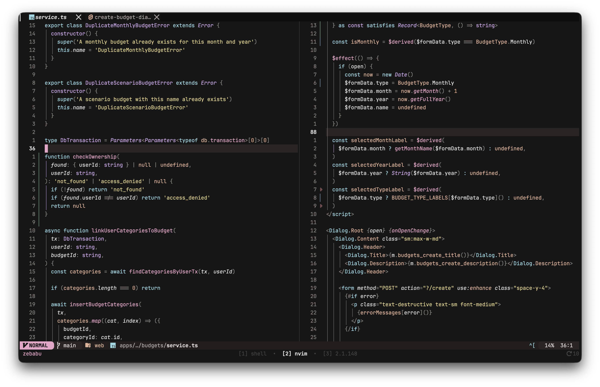
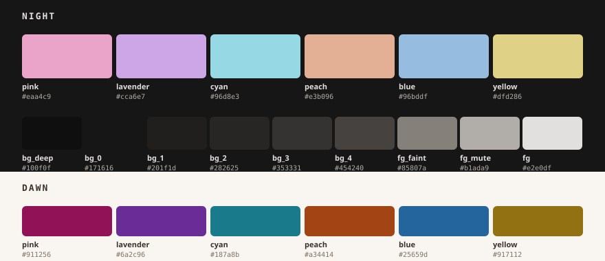
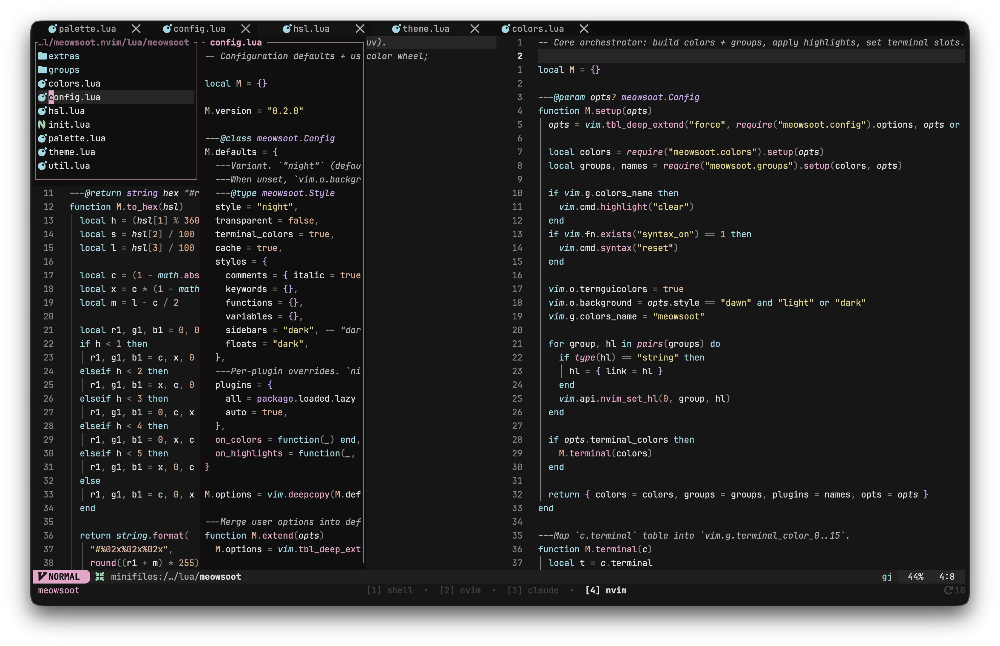
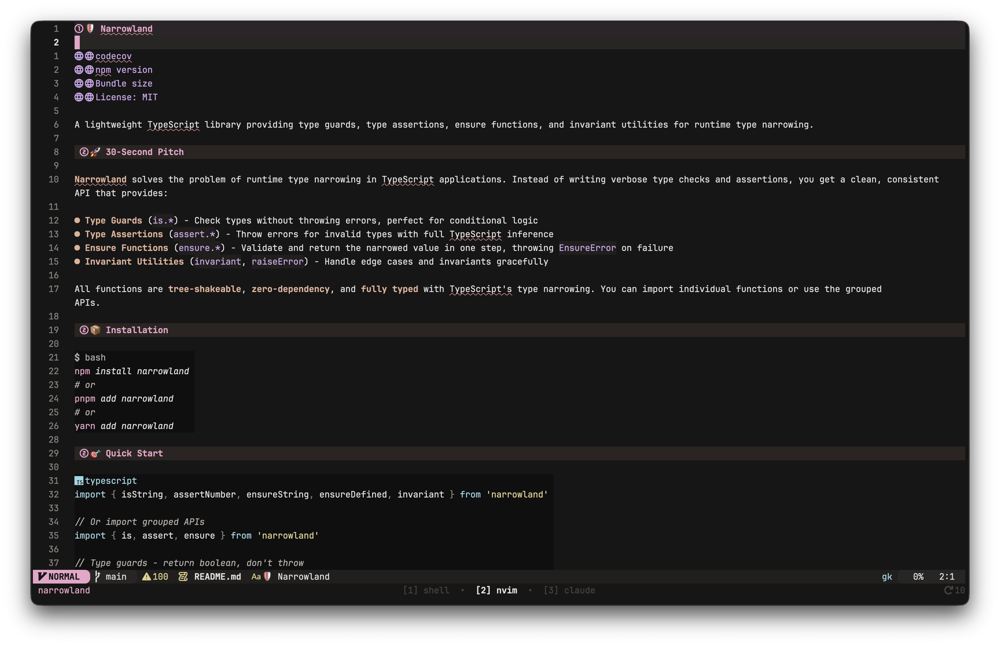
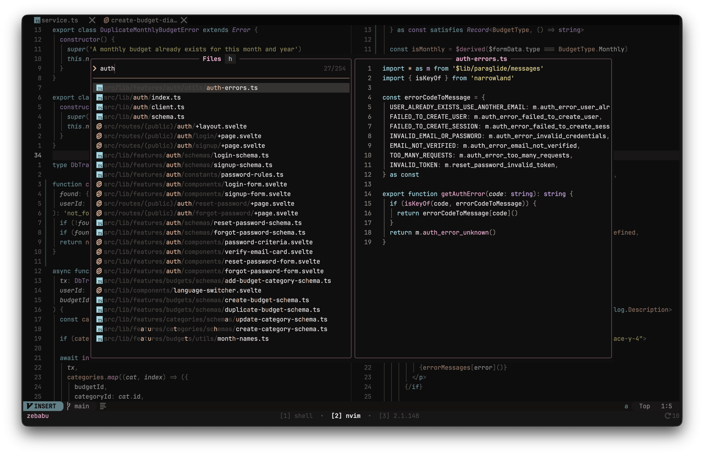
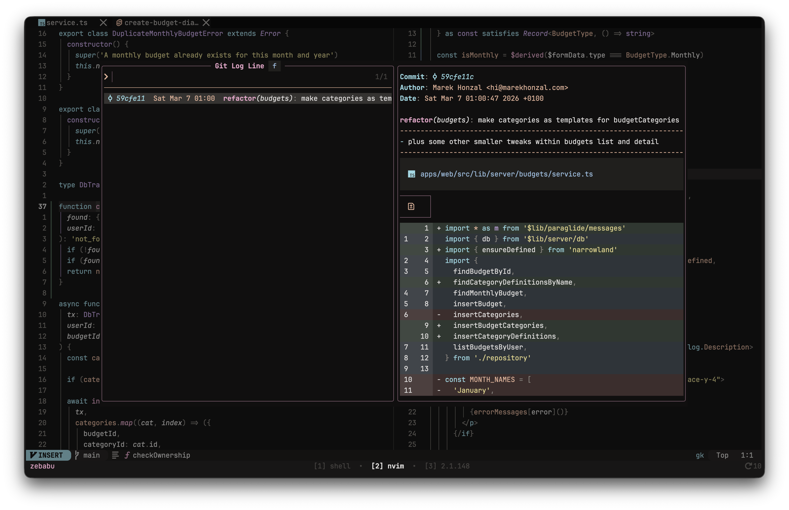
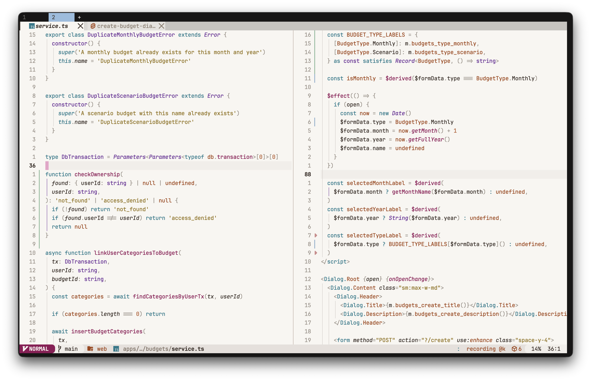
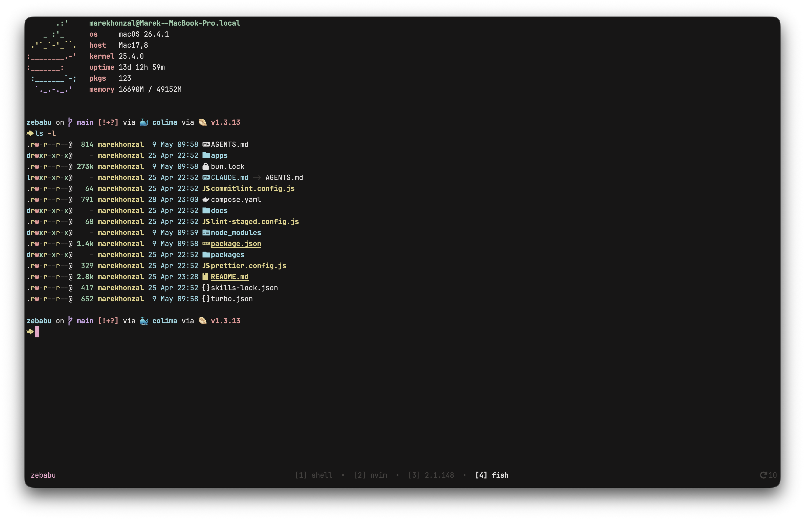

# meowsoot.nvim

[](https://github.com/marekh19/meowsoot.nvim/actions/workflows/ci.yml)

A pink–cyan–lavender Neovim colorscheme. Strings are yellow, functions are pink, types are lavender — and **green never reaches code**.

Pure Lua. Zero runtime dependencies. Authored in HSL, AAA contrast on the night variant.



## Why meowsoot

- **No green in code.** Most schemes use green for strings or comments. meowsoot reroutes the chroma — strings are yellow, types are lavender, functions are pink, keywords are cyan. The result is a syntax surface that's immediately recognisable in any screenshot. The invariant is structural, not stylistic — `green` isn't on the `c` table that group files can see, so a regression would fail loudly at load time. Green still appears in the only places that need it: diff add, git add, success states, the ANSI terminal slot.
- **Six chromatic accents, tuned together.** Anchored at 190° · 208° · 275° · 328° · 20° · 50° — cyan, blue, lavender, pink, peach, yellow. Warm-biased. Three lightness tiers per accent (ANCHOR / STANDARD / QUIET) so the visual hierarchy of the syntax tree comes through without arbitrary highlight noise.
- **Pure Lua, zero dependencies.** ~50-line HSL → hex engine. No plenary, no required treesitter, no `lush.nvim`. Loads fast, caches compiled highlights, easy to fork.
- **22 plugin integrations, auto-detected via `lazy.nvim`.** Telescope, fzf-lua, Snacks, Gitsigns, nvim-cmp, blink.cmp, mini.*, noice, which-key, trouble, render-markdown, treesitter-context, flash, lazy.nvim, nvim-tree, indent-blankline. Bundled lualine theme.
- **Ecosystem in the box.** Matching configs for Ghostty, Kitty, Alacritty, WezTerm, Tmux, Fish, and fzf live in `extras/`, regenerated from the same palette. Your editor identity carries through to your shell.

## Palette

Both variants are resolved from the same HSL source of truth (`lua/meowsoot/palette.lua`). The swatch below is regenerated whenever the palette changes — run `just extras` to refresh.



The night variant is the main act; **dawn** is a complementary light counterpart with the same hue identity, tier-inverted for readability on cream.

## Showcase

**The full editor surface.** File tree, split buffers, lualine — all keyed to the same six-hue chromatic system.



**Markdown via `render-markdown.nvim`.** The rainbow heading wash, fenced code blocks, badges, inline links — all in palette.



**Pickers.** Fuzzy file search floating over a code buffer.



**Git surface.** Log view with an inline commit diff. The only place green is allowed to appear — for `add` lines and nothing else.



**Dawn variant.** The same scene in light mode — same hue identity, tier-inverted for readability on warm cream.



**Terminal ecosystem.** Ghostty, Kitty, Alacritty, WezTerm, Tmux, and Fish all themed via the `extras/` configs, regenerated from the same palette.



## The story

A fusion of two ideas. The charcoal background is inspired by **Susuwatari** — the wandering soot sprites from Studio Ghibli films. The pink and peach accents are inspired by **Nyan Cat**'s pop-tart palette. The rest of the colors — cyan, lavender, yellow, blue — were tuned to round out the chromatic system.

The **dawn** variant carries the same hue identity onto a warm cream background: the same soot sprites, woken up at sunrise.

## Install

Requires Neovim 0.9+. No external dependencies.

### lazy.nvim

```lua
{
  "marekh19/meowsoot.nvim",
  lazy = false,
  priority = 1000,
  config = function()
    vim.cmd.colorscheme("meowsoot")
  end,
}
```

### Local development

```lua
{
  dir = "/path/to/meowsoot",
  lazy = false,
  priority = 1000,
  config = function()
    vim.cmd.colorscheme("meowsoot")
  end,
}
```

## Configuration

All options are optional. Defaults shown.

```lua
require("meowsoot").setup({
  style = "night",                -- "night" (dark) | "dawn" (light)
  transparent = false,            -- transparent backgrounds
  terminal_colors = true,         -- set vim.g.terminal_color_0..15

  styles = {
    comments  = { italic = true },
    keywords  = {},
    functions = {},
    variables = {},
    sidebars  = "dark",           -- "dark" | "transparent" | "normal"
    floats    = "dark",
  },

  -- Plugin highlight groups. Auto-detected via lazy.nvim if `auto = true`.
  plugins = {
    all  = false,
    auto = true,
    -- Force-enable / disable individual plugins:
    -- telescope = true,
    -- gitsigns = false,
  },

  cache = true,                   -- cache compiled highlights to disk

  on_colors = function(c) end,    -- mutate the color table
  on_highlights = function(hl, c) end, -- mutate the highlight table
})
vim.cmd.colorscheme("meowsoot")
```

### Variants

Two ways to pick a variant:

```lua
require("meowsoot").setup({ style = "dawn" })
vim.cmd.colorscheme("meowsoot")
```

Or skip `setup` entirely and use the per-variant entry point:

```vim
:colorscheme meowsoot          " night
:colorscheme meowsoot-dawn     " dawn
```

To flip variants with `:set background=light` / `dark`, wire an autocmd:

```lua
vim.api.nvim_create_autocmd("OptionSet", {
  pattern = "background",
  callback = function()
    vim.cmd.colorscheme(vim.o.background == "light" and "meowsoot-dawn" or "meowsoot")
  end,
})
```

### Lualine

Use the bundled lualine theme:

```lua
require("lualine").setup({ options = { theme = "meowsoot" } })
```

It reads the active variant from `vim.o.background` and re-resolves on every `:colorscheme` switch, so it stays in sync.

### Plugins covered out of the box

`gitsigns` · `telescope` · `nvim-cmp` · `blink.cmp` · `lazy.nvim` · `flash.nvim` · `nvim-tree` · `indent-blankline` · `treesitter-context` · `snacks.nvim` · `mini.icons` / `mini.files` / `mini.statusline` / `mini.indentscope` / `mini.diff` / `mini.notify` / `mini.pick` · `noice` · `which-key` · `trouble` · `render-markdown` · `fzf-lua`

## Extras (terminal / multiplexer / shell)

Pre-generated configs live in `extras/`:

| Tool      | File                              |
|-----------|-----------------------------------|
| Ghostty   | `extras/ghostty/meowsoot`         |
| Kitty     | `extras/kitty/meowsoot.conf`      |
| Alacritty | `extras/alacritty/meowsoot.toml`  |
| WezTerm   | `extras/wezterm/meowsoot.toml`    |
| Tmux      | `extras/tmux/meowsoot.tmux`       |
| Fish      | `extras/fish/meowsoot.fish`       |
| fzf       | `extras/fzf/meowsoot.conf`        |

These are output artifacts — don't edit by hand, they get overwritten on regeneration. They're pinned to the **night** palette so the terminal identity stays canonical even if you switch the editor to dawn.

### Regenerating

After tuning `lua/meowsoot/palette.lua`:

```sh
just extras
```

Built by a small Lua generator (`lua/meowsoot/extras/`) using only headless Neovim — no external build dependencies. The README palette swatch (`static/palette.svg`) is regenerated by the same target.

## Hacking the palette

Authored in HSL (`{h, s, l}`) for ergonomic tuning on the color wheel, resolved to hex at load time via `lua/meowsoot/hsl.lua`. Edit `lua/meowsoot/palette.lua` to shift hues / saturation / lightness; the rest of the theme follows automatically.

### No green in code — enforcement

Green never reaches a syntax group. The chokepoint is `lua/meowsoot/colors.lua` — `green` is intentionally **not** exposed as a top-level key on the resolved colors table. Code-shaped group files (`groups/base.lua` syntax section, `groups/treesitter.lua`, `groups/semantic_tokens.lua`, `groups/kinds.lua`) cannot reach it. Green leaks only through the semantic aliases `c.git.add`, `c.diff.add`, `c.ok`, `c.terminal.green`, and the `mini.icons` UI category.

### Recipes

| Recipe              | What it does |
|---------------------|--------------|
| `just check`        | Headless smoke-test: load the colorscheme, fail on errors |
| `just extras`       | Regenerate everything under `extras/` plus `static/palette.svg` |
| `just fmt`          | Run `stylua` over `lua/` and `colors/` |
| `just check-fmt`    | Verify `stylua` formatting (exits non-zero if dirty) |
| `just cache-clean`  | Drop the compiled-highlights cache |

## Architecture

Inspired by [tokyonight.nvim](https://github.com/folke/tokyonight.nvim).

```
lua/meowsoot/
  init.lua            -- setup(opts) / load()
  config.lua          -- defaults + user-merge
  theme.lua           -- orchestrator: colors → groups → nvim_set_hl
  util.lua            -- blend / darken / lighten / template / cache
  hsl.lua             -- HSL ↔ hex (~50 lines, no dependencies)
  palette.lua         -- HSL palette (single source of truth, both variants)
  colors.lua          -- HSL → hex + semantic alias layer ("no green in code" chokepoint)
  groups/
    init.lua          -- aggregator: cache, plugin auto-detect via lazy
    base.lua          -- editor UI + native Syntax/* + diff/git UI
    treesitter.lua    -- @* groups
    semantic_tokens.lua  -- @lsp.*
    kinds.lua         -- LSP kind helper
    plugins/          -- per-plugin overrides
  extras/             -- ghostty / kitty / alacritty / wezterm / tmux / fish / fzf / palette-svg generators
```
